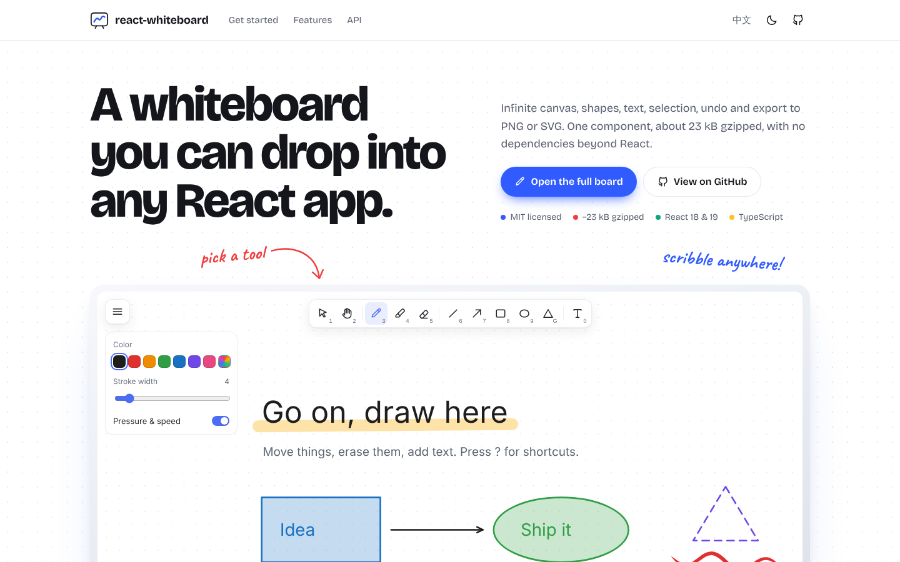

<div align="center">


# react-whiteboard

**A whiteboard you can drop into any React app.**
Infinite canvas, shapes, text, selection, undo and PNG / SVG export — about 23 kB gzipped, no dependencies beyond React.

[Live demo](https://inchill.github.io/react-whiteboard/) · [Open the full board](https://inchill.github.io/react-whiteboard/board/) · [中文文档](./README.zh-CN.md)

[](https://github.com/Inchill/react-whiteboard/actions/workflows/ci.yml)
[](./LICENSE)

<picture>
  <source media="(prefers-color-scheme: dark)" srcset="docs/screenshot-en-dark.png" />
  
</picture>

</div>

## Features

- **11 tools** — select, hand, pen, highlighter, eraser, line, arrow, rectangle, ellipse, triangle, text
- **Vector scene** — every stroke is a shape you can select, move, restyle, reorder, duplicate or delete; resizing the window never loses work
- **Infinite canvas** — pan with Space / hand tool / trackpad, zoom with Ctrl + wheel or pinch, one click to show all content
- **Undo / redo** — 200 steps, including clearing the canvas
- **Export** — PNG, SVG, copy PNG to clipboard, save/open `.json` (also by drag-and-drop)
- **Keyboard first** — single-key tool shortcuts, Shift to constrain angles and squares, arrow keys to nudge, `?` for the cheat sheet
- **Feels like a pen** — strokes follow Apple Pencil / tablet pressure (or drawing speed with a mouse or finger) and taper at both ends
- **Rub-out eraser** — erase just the part of a stroke you rub over, or switch to removing whole shapes
- **Touch & stylus** — Pointer Events with coalesced samples, two-finger pinch zoom
- **Autosave** to `localStorage`, **dark mode**, **English / 中文 UI**
- Written in TypeScript, fully typed public API

## How it compares

| | **react-whiteboard** | [Excalidraw](https://github.com/excalidraw/excalidraw) | [tldraw](https://github.com/tldraw/tldraw) | [react-sketch-canvas](https://github.com/vinothpandian/react-sketch-canvas) |
| --- | --- | --- | --- | --- |
| License | MIT | MIT | tldraw license (license key required in production) | MIT |
| JS loaded on mount (gzip) | **~23 kB** | ~390 kB (~2.6 MB incl. lazy chunks) | ~720 kB | ~8 kB |
| Runtime dependencies | **0** | 31 | 17 | 0 |
| Freehand pen | ✅ | ✅ | ✅ | ✅ |
| Pressure / speed-sensitive strokes | ✅ | ✅ | ✅ | ❌ |
| Rub-out eraser (erase part of a stroke) | ✅ | ❌ | ❌ | ✅ |
| Shapes, arrows, text | ✅ | ✅ | ✅ | ❌ |
| Select / move / restyle | ✅ | ✅ | ✅ | ❌ |
| Infinite canvas (pan & zoom) | ✅ | ✅ | ✅ | ❌ |
| Undo / redo | ✅ | ✅ | ✅ | ✅ |
| Export PNG / SVG | ✅ | ✅ | ✅ | ✅ |
| Save / load JSON | ✅ | ✅ | ✅ | ✅ (paths) |
| Dark mode | ✅ | ✅ | ✅ | ❌ |
| Chinese UI | ✅ | ✅ | ✅ | — (no UI) |
| Images | ❌ | ✅ | ✅ | background only |
| Hand-drawn look | ❌ | ✅ | ✅ | ❌ |
| Real-time collaboration | ❌ | ✅ (bring your own server) | ✅ (via `@tldraw/sync`) | ❌ |

**Pick react-whiteboard** when you want a full whiteboard inside your own product (a teaching board, sketch annotations, a scratch pad) without adding hundreds of kilobytes or a commercial license.
**Pick Excalidraw or tldraw** when you need collaboration, images, diagrams or a hand-drawn look. **Pick react-sketch-canvas** when freehand strokes are all you need.

<sub>Sizes measured on 2026-10-08 by bundling each package's main component with Vite 7 (React excluded, minified, gzip): @inchill/react-whiteboard 1.0.0, @excalidraw/excalidraw 0.18.1, tldraw 5.5.2, react-sketch-canvas 8.0.0. Dependency counts are direct `dependencies` from npm.</sub>

## Quick start

```bash
pnpm add @inchill/react-whiteboard
# or: npm install @inchill/react-whiteboard
```

```tsx
import '@inchill/react-whiteboard/style.css';
import { Whiteboard } from '@inchill/react-whiteboard';

export default function App() {
  return (
    <div style={{ height: '100vh' }}>
      <Whiteboard />
    </div>
  );
}
```

The board fills its parent, so give the parent a height. React 18 and 19 are supported.

### Embedding in a page

When the board is one element of a longer page, let the page keep the wheel and the keyboard:

```tsx
<Whiteboard storageKey="my-page-board" globalShortcuts={false} captureWheel={false} />
```

### A simple doodle pad

Show only the tools you need. Number keys 1–3 then select them in this order:

```tsx
<Whiteboard tools={['pen', 'highlighter', 'eraser']} />
```

### Reading and writing the drawing

```tsx
import { useRef } from 'react';
import { Whiteboard, type WhiteboardHandle } from '@inchill/react-whiteboard';

function Editor() {
  const board = useRef<WhiteboardHandle>(null);

  const save = async () => {
    const json = board.current!.exportJson();      // persist anywhere
    const png = await board.current!.exportPng();  // Blob | null
  };

  return <Whiteboard ref={board} storageKey={null} onChange={(shapes) => console.log(shapes.length)} />;
}
```

## API

### Props

| Prop | Type | Default | Description |
| --- | --- | --- | --- |
| `storageKey` | `string \| null` | `"react-whiteboard"` | localStorage key for autosave; `null` disables it |
| `initialShapes` | `Shape[]` | `[]` | Shapes to start with when nothing is saved |
| `theme` | `"light" \| "dark"` | system | Controlled theme; leave unset to show a toggle in the menu |
| `locale` | `"en" \| "zh"` | browser | Controlled UI language; leave unset to show a toggle |
| `initialTool` | `Tool` | `"pen"` | Tool selected on mount |
| `tools` | `Tool[]` | all tools | Tools shown in the toolbar and reachable by shortcut, in this order; number keys follow this order |
| `onChange` | `(shapes: Shape[]) => void` | — | Called after each committed change |
| `onThemeChange` | `(theme: Theme) => void` | — | Called when the user toggles the theme |
| `globalShortcuts` | `boolean` | `true` | Listen for shortcuts on `window` (otherwise only while focused) |
| `captureWheel` | `boolean` | `true` | Plain wheel / trackpad scroll pans the canvas |
| `showMenu` | `boolean` | `true` | Show the main menu (file, export, settings) |
| `githubUrl` | `string` | — | Adds a GitHub link to the menu |
| `className`, `style` | | | Applied to the root element |

### Ref methods (`WhiteboardHandle`)

| Method | Description |
| --- | --- |
| `getShapes()` | Current shapes |
| `setShapes(shapes, { history? })` | Replace the drawing (undoable unless `history: false`) |
| `undo()`, `redo()`, `clear()` | Same as the UI |
| `exportPng({ theme, background, padding, scale })` | `Promise<Blob \| null>` |
| `exportSvg({ theme, background, padding })` | SVG string |
| `exportJson()` | JSON string, readable by **Open…** and `deserialize()` |
| `zoomToFit()` | Fit all content in view |

Standalone helpers `exportToSvg`, `exportToPngBlob`, `serialize` and `deserialize` are exported too, so you can turn saved drawings into images without mounting the board.

### Data format

```jsonc
{
  "type": "react-whiteboard",
  "version": 1,
  "shapes": [
    { "id": "…", "type": "rect", "x": 0, "y": 0, "w": 120, "h": 80, "fill": "semi",
      "color": "#1971c2", "strokeWidth": 3, "strokeStyle": "solid" }
  ]
}
```

The color `"ink"` means “the theme's foreground”, so drawings stay readable in both light and dark mode.

## Keyboard shortcuts

| Action | Keys |
| --- | --- |
| Tools | `V` select · `H` hand · `P` pen · `M` highlighter · `E` eraser · `L` line · `A` arrow · `R` rectangle · `O` ellipse · `G` triangle · `T` text (or `1`–`0`) |
| Undo / redo | `Ctrl/⌘ Z` / `Ctrl/⌘ Shift Z`, `Ctrl Y` |
| Select all, duplicate, copy, paste, cut | `Ctrl/⌘ A`, `D`, `C`, `V`, `X` |
| Delete selection | `Delete` / `Backspace` |
| Nudge | arrow keys (`Shift` for 10 px) |
| Send to back / bring to front | `[` / `]` |
| Pan | hold `Space` and drag, or middle mouse |
| Zoom | `Ctrl/⌘` + wheel, `Ctrl/⌘ +` / `-`, `Ctrl/⌘ 0` to reset, `Shift 1` to show all content |
| Constrain while drawing | hold `Shift` |
| Help | `?` |

## Development

Requires **Node.js 24+** and **pnpm 10+** (`corepack enable` picks up the pinned pnpm version).

```bash
pnpm install
pnpm dev          # website at http://localhost:5173, full board at /board/
pnpm test         # unit + component tests (Vitest)
pnpm lint
pnpm build        # website → dist/site
pnpm build:lib    # library → dist/lib
```

```
src/
  whiteboard/   the library: component, renderer, geometry, history, export, i18n
  site/         the landing page (live demo + docs)
  app/          the full-screen board at /board/
tests/          Vitest unit and component tests
```

The website deploys to GitHub Pages from `main` (see `.github/workflows/deploy.yml`). Pushing a `v*` tag publishes the package to npm (needs an `NPM_TOKEN` secret).

## Contributing

Issues and pull requests are welcome — see [CONTRIBUTING.md](./CONTRIBUTING.md).

## License

[MIT](./LICENSE) © Inchill
