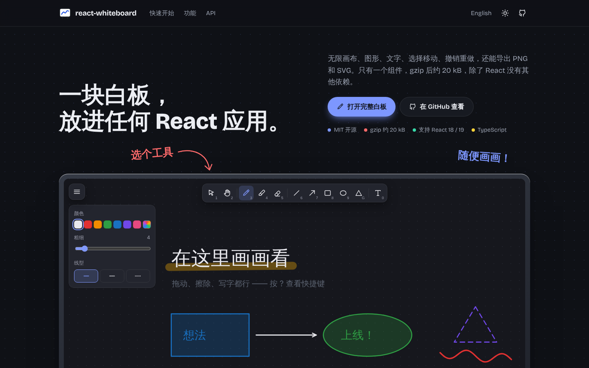

<div align="center">


# react-whiteboard

**一块白板，放进任何 React 应用。**
无限画布、图形、文字、选择移动、撤销重做、导出 PNG / SVG —— gzip 后约 23 kB，除了 React 没有其他依赖。

[在线演示](https://inchill.github.io/react-whiteboard/) · [打开完整白板](https://inchill.github.io/react-whiteboard/board/) · [English](./README.md)



</div>

## 功能

- **11 种工具**：选择、抓手、画笔、荧光笔、橡皮擦、直线、箭头、矩形、椭圆、三角形、文字
- **矢量场景**：每一笔都是图形，可以选中、移动、改样式、调层级、复制、删除；调整窗口大小不会丢内容
- **无限画布**：空格 / 抓手 / 触控板平移，Ctrl + 滚轮或双指捏合缩放，一键显示全部内容
- **撤销重做**：最多 200 步，清空画布也能撤销
- **导出**：PNG、SVG、复制 PNG 到剪贴板，保存 / 打开 `.json`（支持拖拽文件进画布）
- **键盘优先**：单键切换工具，Shift 锁定角度 / 正方形，方向键微调，按 `?` 查看全部快捷键
- **像真笔一样**：线条粗细跟随 Apple Pencil / 数位板的压力变化（用鼠标或手指时随书写速度变化），起笔收笔自然变尖
- **局部擦除**：只擦掉划过的那一段笔画，也可以切换成整笔删除
- **触屏与手写笔**：基于 Pointer Events 并读取合并采样点，支持双指缩放
- **自动保存**到 `localStorage`，**深色模式**，**中英文界面**
- TypeScript 编写，公开 API 有完整类型

## 与同类项目对比

| | **react-whiteboard** | [Excalidraw](https://github.com/excalidraw/excalidraw) | [tldraw](https://github.com/tldraw/tldraw) | [react-sketch-canvas](https://github.com/vinothpandian/react-sketch-canvas) |
| --- | --- | --- | --- | --- |
| 协议 | MIT | MIT | tldraw 自有协议（生产环境需许可证密钥） | MIT |
| 首次加载 JS（gzip） | **约 23 kB** | 约 390 kB（含按需加载部分约 2.6 MB） | 约 720 kB | 约 8 kB |
| 运行时依赖 | **0** | 31 | 17 | 0 |
| 自由手绘 | ✅ | ✅ | ✅ | ✅ |
| 压感 / 速度笔迹 | ✅ | ✅ | ✅ | ❌ |
| 局部擦除（擦掉笔画的一部分） | ✅ | ❌ | ❌ | ✅ |
| 图形、箭头、文字 | ✅ | ✅ | ✅ | ❌ |
| 选择 / 移动 / 改样式 | ✅ | ✅ | ✅ | ❌ |
| 无限画布（平移缩放） | ✅ | ✅ | ✅ | ❌ |
| 撤销 / 重做 | ✅ | ✅ | ✅ | ✅ |
| 导出 PNG / SVG | ✅ | ✅ | ✅ | ✅ |
| 保存 / 载入 JSON | ✅ | ✅ | ✅ | ✅（路径数据） |
| 深色模式 | ✅ | ✅ | ✅ | ❌ |
| 中文界面 | ✅ | ✅ | ✅ | —（无界面） |
| 插入图片 | ❌ | ✅ | ✅ | 仅背景图 |
| 手绘风格 | ❌ | ✅ | ✅ | ❌ |
| 多人实时协作 | ❌ | ✅（需自建服务端） | ✅（通过 `@tldraw/sync`） | ❌ |

**选 react-whiteboard**：想在自己的产品里放一块完整的白板（教学板书、草图标注、草稿区），又不想增加几百 kB 体积或购买商业授权。
**选 Excalidraw / tldraw**：需要多人协作、插入图片、画流程图或手绘风格。**选 react-sketch-canvas**：只需要自由手绘。

<sub>体积测量于 2026-10-08：用 Vite 7 分别打包各库的主组件（不含 React，压缩后 gzip），版本为 @inchill/react-whiteboard 1.0.0、@excalidraw/excalidraw 0.18.1、tldraw 5.5.2、react-sketch-canvas 8.0.0。依赖数为 npm 上的直接 `dependencies`。</sub>

## 快速开始

```bash
pnpm add @inchill/react-whiteboard
# 或：npm install @inchill/react-whiteboard
```

```tsx
import '@inchill/react-whiteboard/style.css';
import { Whiteboard } from '@inchill/react-whiteboard';

export default function App() {
  return (
    <div style={{ height: '100vh' }}>
      <Whiteboard locale="zh" />
    </div>
  );
}
```

白板会撑满父元素，所以父元素需要有高度。支持 React 18 和 19。

### 嵌入到普通页面

如果白板只是长页面中的一块，建议把滚轮和键盘留给页面：

```tsx
<Whiteboard storageKey="my-page-board" globalShortcuts={false} captureWheel={false} />
```

### 简单的涂鸦板

只显示需要的工具，数字键 1–3 按这个顺序切换：

```tsx
<Whiteboard tools={['pen', 'highlighter', 'eraser']} />
```

### 读取 / 写入画板内容

```tsx
const board = useRef<WhiteboardHandle>(null);

const json = board.current!.exportJson();       // 存到任何地方
const png = await board.current!.exportPng();   // Blob | null
board.current!.setShapes(deserialize(json));    // 再载入
```

## API

### Props

| 属性 | 类型 | 默认值 | 说明 |
| --- | --- | --- | --- |
| `storageKey` | `string \| null` | `"react-whiteboard"` | 自动保存使用的 localStorage key，`null` 关闭 |
| `initialShapes` | `Shape[]` | `[]` | 没有已保存内容时的初始图形 |
| `theme` | `"light" \| "dark"` | 跟随系统 | 受控主题；不传时菜单中显示切换开关 |
| `locale` | `"en" \| "zh"` | 跟随浏览器 | 受控界面语言；不传时菜单中可切换 |
| `initialTool` | `Tool` | `"pen"` | 初始工具 |
| `tools` | `Tool[]` | 全部工具 | 工具栏显示哪些工具、按什么顺序；没列出的工具快捷键也不生效，数字快捷键按这个顺序编号 |
| `onChange` | `(shapes: Shape[]) => void` | — | 每次提交修改后调用 |
| `onThemeChange` | `(theme: Theme) => void` | — | 用户切换主题时调用 |
| `globalShortcuts` | `boolean` | `true` | 在 `window` 上监听快捷键（否则仅在白板获得焦点时） |
| `captureWheel` | `boolean` | `true` | 普通滚轮 / 触控板滚动用于平移画布 |
| `showMenu` | `boolean` | `true` | 是否显示主菜单 |
| `githubUrl` | `string` | — | 在菜单中添加 GitHub 链接 |

### Ref 方法

| 方法 | 说明 |
| --- | --- |
| `getShapes()` | 获取当前图形 |
| `setShapes(shapes, { history? })` | 替换内容（`history: false` 时不记录撤销） |
| `undo()` / `redo()` / `clear()` | 与界面按钮相同 |
| `exportPng(options)` | 返回 `Promise<Blob \| null>` |
| `exportSvg(options)` | 返回 SVG 字符串 |
| `exportJson()` | 返回 JSON 字符串 |
| `zoomToFit()` | 缩放到能看到全部内容 |

此外还导出了 `exportToSvg`、`exportToPngBlob`、`serialize`、`deserialize` 等函数，不挂载组件也能把保存的数据转成图片。

## 本地开发

需要 **Node.js 24+** 和 **pnpm 10+**（执行 `corepack enable` 即可自动使用项目锁定的 pnpm 版本）。

```bash
pnpm install
pnpm dev          # 官网 http://localhost:5173，完整白板在 /board/
pnpm test         # 单元测试 + 组件测试（Vitest）
pnpm lint
pnpm build        # 官网 → dist/site
pnpm build:lib    # 组件库 → dist/lib
```

- `src/whiteboard/`：组件库本体（组件、渲染、几何、历史记录、导出、国际化）
- `src/site/`：官网首页（在线演示 + 文档）
- `src/app/`：`/board/` 全屏白板
- `tests/`：Vitest 单元测试和组件测试

推送到 `main` 会自动部署官网到 GitHub Pages；推送 `v*` 标签会发布到 npm（需要配置 `NPM_TOKEN` secret）。

## 参与贡献

欢迎提 Issue 和 PR，详见 [CONTRIBUTING.md](./CONTRIBUTING.md)。

## 协议

[MIT](./LICENSE) © Inchill
